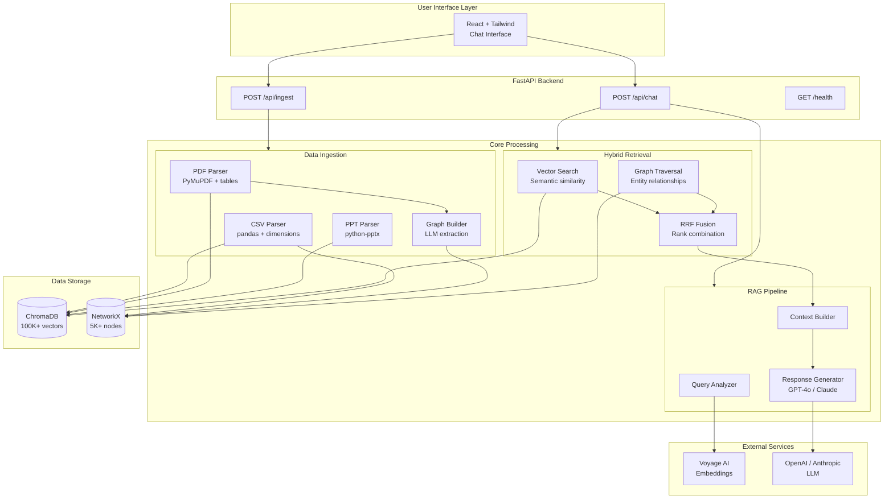
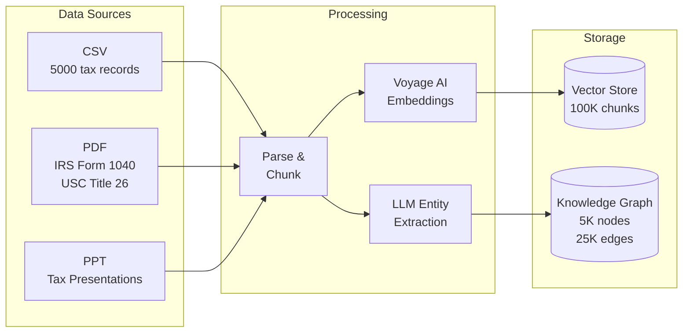
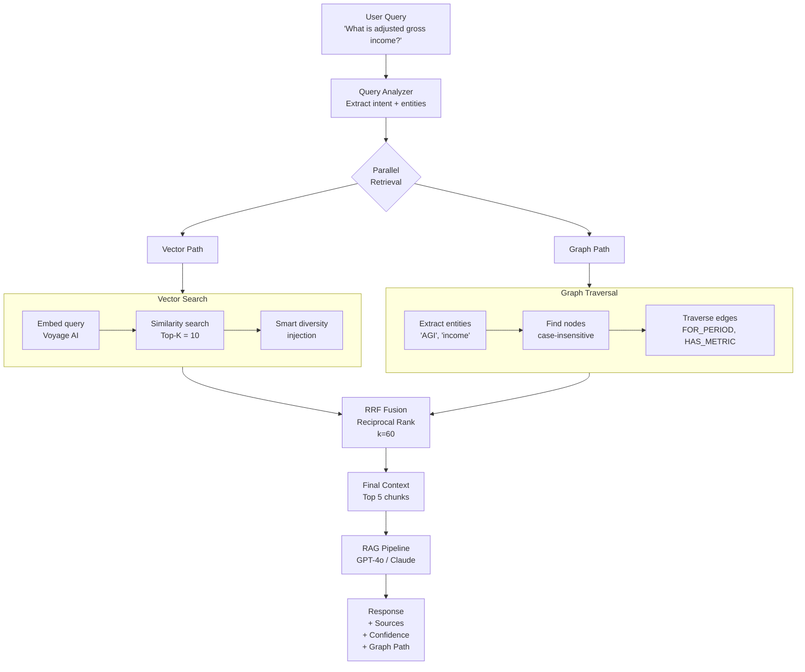
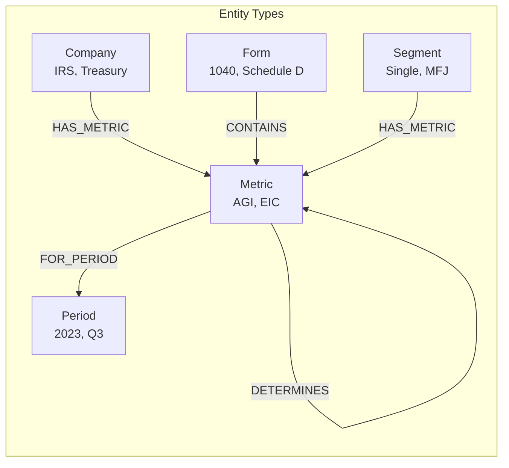
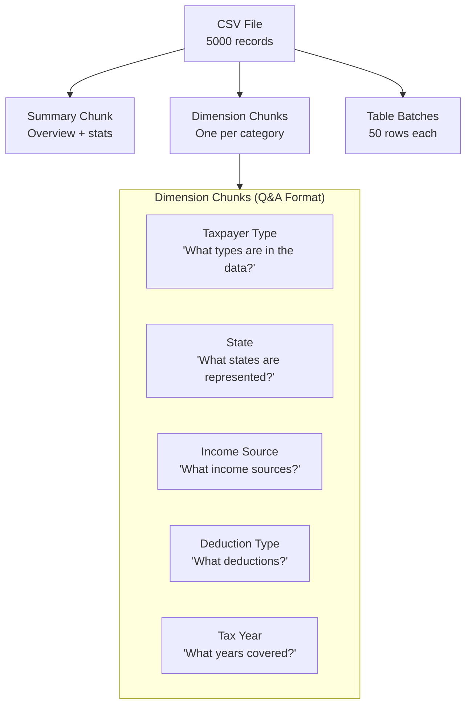
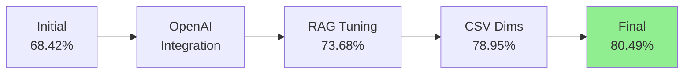
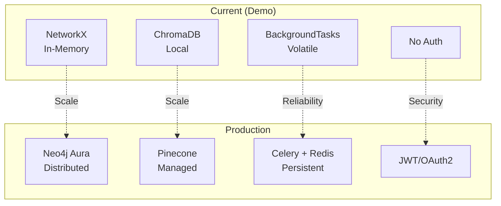

# TaxAI - Financial Intelligence Chatbot

> **Hybrid RAG Chatbot** combining Vector Search + Knowledge Graph for accurate financial Q&A

[](https://www.python.org/downloads/)
[](https://fastapi.tiangolo.com/)
[](https://reactjs.org/)

[Demo Video](https://www.loom.com/share/ca937286f2f64c5aabc0133c34ead84c) | [Live Demo](https://taxgptbot.vercel.app/) | [Evaluation Results](#evaluation-results) | [API Docs](#api-reference)

---

## Table of Contents

- [Quick Start](#quick-start)
- [System Architecture](#system-architecture)
- [How It Works](#how-it-works)
- [Design Decisions & Trade-offs](#design-decisions--trade-offs)
- [Evaluation Results](#evaluation-results)
- [API Reference](#api-reference)
- [Local Development](#local-development)
- [Challenges & Solutions](#challenges--solutions)
- [Production Considerations](#production-considerations)
- [Author](#author)

---

## Quick Start

```bash
# 1. Clone the repository
git clone <your-repo-url>
cd taxai

# 2. Set up environment variables
cp .env.example backend/.env
# Edit backend/.env with your API keys (ANTHROPIC_API_KEY, VOYAGE_API_KEY, OPENAI_API_KEY)

# 3. Download pre-built data (ChromaDB + Knowledge Graph)
# Option A: Download from Google Drive
# https://drive.google.com/file/d/1qiCbwuwx42Eqyzw9mGL5r6MOt3DxDF49/view?usp=sharing
# Extract to backend/data/

# Option B: Use gdown (automated)
pip install gdown
gdown "1qiCbwuwx42Eqyzw9mGL5r6MOt3DxDF49" -O /tmp/data.tar.gz
mkdir -p backend/data && tar -xzf /tmp/data.tar.gz -C backend/data

# 4. Run with Docker (recommended)
docker-compose up --build
```

**Pre-built Data Download:**
| File | Contents | Size |
|------|----------|------|
| [taxai-data.tar.gz](https://drive.google.com/file/d/1qiCbwuwx42Eqyzw9mGL5r6MOt3DxDF49/view?usp=sharing) | ChromaDB (100K vectors) + graph.pkl (5K nodes) | 514 MB |

The app will be available at:
- **Frontend**: http://localhost:3000
- **Backend API**: http://localhost:8000
- **API Docs**: http://localhost:8000/docs

---

## System Architecture

### High-Level Architecture



### Data Flow Pipeline



---

## How It Works

### Hybrid Retrieval: The Core Innovation

Most RAG systems use vector search alone. This system combines **semantic vector search** with **structured graph traversal** for superior accuracy on financial queries.



### Why Hybrid Retrieval?

| Approach | Strength | Weakness |
|----------|----------|----------|
| **Vector Only** | Semantic understanding, natural language | No relationship awareness |
| **Graph Only** | Structured relationships, multi-hop | Limited to extracted entities |
| **Hybrid (Ours)** | Best of both worlds | Slightly more complex |

**Example Query**: "Compare Q3 revenue to Q3 last year"
- **Vector**: Finds chunks mentioning "revenue" and "Q3"
- **Graph**: Traverses `Revenue_Q3_2024 --[COMPARED_TO]--> Revenue_Q3_2023`
- **Combined**: Both semantic context AND explicit relationships

---

### Knowledge Graph Schema



**Graph Statistics:**
- **5,031 nodes** (entities + transactions)
- **25,000 edges** (relationships)
- **7 relationship types** (FOR_PERIOD, HAS_METRIC, COMPARED_TO, etc.)

**Sample Edges:**
```
Earned Income Credit --[FOR_PERIOD]--> 2023
Single Filing Status --[HAS_METRIC]--> Tax Amount
Taxable Income --[DETERMINES]--> Tax Amount
Form 1040 --[CONTAINS]--> Schedule D
```

---

### CSV Processing Strategy

The CSV parser creates **dimension chunks** with Q&A format for optimal semantic matching:



**Why Q&A Format?**

The dimension chunks embed the **question** alongside the **answer**:
```
Question: What are the different taxpayer types in the tax data?
Answer: There are 5 different taxpayer types:
- Corporation: 1061 records (21.2%)
- Individual: 954 records (19.1%)
...
```

When a user asks "What taxpayer types are there?", the semantic similarity is much higher because the chunk literally contains similar phrasing. This is a form of **Hypothetical Document Embedding (HyDE)**.

---

## Design Decisions & Trade-offs

### Technology Choices

| Component | Choice | Why | Alternative | Trade-off |
|-----------|--------|-----|-------------|-----------|
| **Vector DB** | ChromaDB | Free, local, persistent, Railway-compatible | Pinecone | Pinecone needs paid tier |
| **Graph DB** | NetworkX | Zero setup, fast for <10K nodes | Neo4j | Neo4j overkill for demo |
| **Embeddings** | Voyage AI `voyage-finance-2` | Finance-specific (understands EBITDA, AGI, etc.), 1024 dims, $0.10/1M tokens | OpenAI `text-embedding-3-large` | OpenAI is generic, may miss financial nuance |
| **LLM** | GPT-4o + Claude | Dual provider support | Single provider | More complexity |
| **Entity Extraction** | LLM-based | Handles financial jargon | Spacy NER | Spacy misses nuance |
| **Table Handling** | Markdown conversion | Preserves structure | Raw text | Raw loses context |
| **Frontend** | React + Tailwind | Professional, full-stack | Streamlit | Streamlit is common |

### Financial-Specific Embeddings: Voyage AI

We use **Voyage AI's `voyage-finance-2`** model instead of generic embeddings like OpenAI's `text-embedding-3-large` or open-source alternatives.

**Why Finance-Specific Embeddings Matter:**

| Model | Dimensions | Finance Understanding | Cost |
|-------|------------|----------------------|------|
| `voyage-finance-2` | 1024 | ⭐⭐⭐⭐⭐ Native financial terminology | $0.10/1M tokens |
| `text-embedding-3-large` | 3072 | ⭐⭐⭐ Generic, learns from context | $0.13/1M tokens |
| `all-mpnet-base-v2` | 768 | ⭐⭐ Basic semantic | Free (local) |

**Example: "What is EBITDA margin?"**

```
voyage-finance-2:
  ✓ Understands EBITDA as Earnings Before Interest, Taxes, Depreciation, Amortization
  ✓ Associates with profitability metrics, operating performance
  ✓ Retrieves related: Operating Margin, Gross Margin, Net Income

generic-embedding:
  ⚠ Treats "EBITDA" as unknown acronym
  ⚠ May retrieve unrelated content about "margin" (e.g., page margins)
```

**Configuration:**
```bash
# .env
EMBEDDING_PROVIDER=voyage
EMBEDDING_MODEL=voyage-finance-2
VOYAGE_API_KEY=pa-...
```

**Fallback Support:**
The system supports OpenAI embeddings as fallback if Voyage AI is unavailable:
```bash
EMBEDDING_PROVIDER=openai
EMBEDDING_MODEL=text-embedding-3-large
```

### Critical Design Decisions

#### 1. LLM-Based Entity Extraction (Not Spacy)

**Problem**: Financial documents contain nuanced metrics that Spacy NER misses.

```
Spacy:  "Adjusted EBITDA margin" → UNKNOWN
LLM:    "Adjusted EBITDA margin excluding restructuring" → METRIC
```

**Trade-off**: Slower ingestion (~2s per chunk) but dramatically better graph quality.

#### 2. Tables → Markdown Before Embedding

**Problem**: Standard chunking destroys table structure.

```
Bad:  "Revenue 56.2B Q3 2024 52.1B Q3 2023"
Good: "| Metric | Q3 2024 | Q3 2023 |\n|---|---|---|\n| Revenue | 56.2B | 52.1B |"
```

The embedding model can now understand row/column relationships.

#### 3. Smart Source Diversity Injection

**Problem**: 100K PDF chunks drown out 105 CSV chunks in retrieval.

```python
# Don't force diversity - inject only when relevant
if minority_result.score >= 0.65 and source not in top_results:
    inject(minority_result)
```

**Trade-off**: Slightly more complex ranking logic, but prevents source domination.

#### 4. Dual LLM Provider Support

**Problem**: Anthropic API returned `529 Overloaded` during evaluation.

**Solution**: Added OpenAI GPT-4o as fallback with easy switching via `.env`:

```bash
LLM_PROVIDER=openai  # or anthropic
LLM_MODEL=gpt-4o     # or claude-sonnet-4-20250514
```

#### 5. Background Processing for Large PDFs

**Problem**: 7700-page PDFs cause HTTP timeouts.


**Trade-off**: Lost if server restarts, but sufficient for demo. Would use Celery + Redis in production.

---

## Evaluation Results

### Current Metrics (41 Questions)

| Metric | Score |
|--------|-------|
| **Recall@5** | **80.49%** (33/41) |
| **MRR@5** | **0.671** |
| **Avg Confidence** | ~0.80 |

### Store Statistics

| Store | Count |
|-------|-------|
| Vector chunks | 100,280 |
| Graph nodes | 5,031 |
| Graph edges | 25,000 |

### Results by Source Type

| Source | Questions | Found | Rate |
|--------|-----------|-------|------|
| tax_data.csv | 7 | 5 | 71% |
| i1040gi.pdf | 23 | 19 | 83% |
| usc26@118-78.pdf | 7 | 7 | **100%** |
| MIC_3e_Ch11.ppt | 4 | 4 | **100%** |

### Improvement History



### Sample Working Questions

**CSV:**
- "What are the different taxpayer types?" ✓
- "What tax years are covered?" ✓

**PDF:**
- "What is adjusted gross income?" ✓
- "What are Form 1040 Helpful Hints?" ✓
- "What happens if you fraudulently claim EIC?" ✓

**PPT:**
- "How does demand elasticity affect tax burden?" ✓
- "How does US compare to other countries in tax receipts?" ✓

### Known Limitations

| Issue | Cause | Fix |
|-------|-------|-----|
| CSV aggregation queries | RAG doesn't compute averages | Add SQL layer |
| Some PDF source confusion | Similar content in multiple docs | Better filtering |

**Run evaluation yourself:**
```bash
cd backend && python scripts/evaluate.py
```

---

## API Reference

### Chat Endpoint

```bash
POST /api/chat
Content-Type: application/json

{
  "message": "What is adjusted gross income?",
  "conversation_id": "optional-uuid"
}
```

**Response:**
```json
{
  "answer": "Adjusted Gross Income (AGI) is your total gross income minus specific deductions...",
  "confidence": 0.85,
  "sources": [
    {
      "file": "i1040gi.pdf",
      "page": 12,
      "snippet": "Your adjusted gross income (AGI) is...",
      "score": 0.87
    }
  ],
  "graph_path": [
    {"node": "Adjusted Gross Income", "type": "metric"},
    {"edge": "DETERMINES"},
    {"node": "Taxable Income", "type": "metric"}
  ]
}
```

### Ingestion Endpoints

```bash
# Synchronous (small files)
POST /api/ingest
Content-Type: multipart/form-data
file: document.pdf

# Asynchronous (large files)
POST /api/ingest/async
Content-Type: multipart/form-data
file: large_document.pdf

# Check progress
GET /api/ingest/status/{task_id}

# List all tasks
GET /api/ingest/tasks
```

### Health Check

```bash
GET /health

{
  "status": "healthy",
  "vector_store": {"document_count": 100280},
  "graph_store": {"node_count": 5031, "edge_count": 25000}
}
```

---

## Local Development

### Prerequisites

- Python 3.11+
- Node.js 18+
- LibreOffice (for old .ppt format support): `brew install --cask libreoffice`

### Backend Setup

```bash
cd backend

# Create virtual environment
python -m venv venv
source venv/bin/activate  # Windows: venv\Scripts\activate

# Install dependencies
pip install -r requirements.txt

# Copy environment variables
cp .env.example .env
# Edit .env with your API keys

# Run server
uvicorn app.main:app --reload --port 8000
```

### Frontend Setup

```bash
cd frontend

npm install
npm run dev
```

### Environment Variables

```bash
# Required API Keys
ANTHROPIC_API_KEY=sk-ant-...
OPENAI_API_KEY=sk-proj-...
VOYAGE_API_KEY=pa-...

# LLM Configuration
LLM_PROVIDER=openai          # or anthropic
LLM_MODEL=gpt-4o             # or claude-sonnet-4-20250514

# Embedding Configuration
EMBEDDING_PROVIDER=voyage
EMBEDDING_MODEL=voyage-finance-2

# Storage
CHROMA_PERSIST_DIR=./data/chroma_db
GRAPH_PERSIST_PATH=./data/graph.pkl

# Performance (for 8GB machines)
LOW_MEMORY_MODE=true
LOW_MEMORY_MAX_WORKERS=2
LOW_MEMORY_EMBEDDING_BATCH_SIZE=8
```

### Running Tests

```bash
cd backend

# Run all tests
pytest tests/ -v
```

### Running Evaluation

The evaluation suite tests the RAG pipeline against 41 pre-defined questions across all data sources (CSV, PDF, PPT).

```bash
# From project root directory

# Run full evaluation (uses backend/tests/eval_dataset.json)
python scripts/evaluate.py

# Run with custom evaluation file
python scripts/evaluate.py --eval-file /path/to/custom_eval.json
```

**Expected Output:**
```
Q: What are the different taxpayer types in the tax data?
A: The taxpayer types in the tax data are: Corporation, Individual, Non-Profit, Partnership, and Trust...
Confidence: 0.92
  Source found at rank 1

Q: What is adjusted gross income?
A: Adjusted Gross Income (AGI) is your total gross income minus certain adjustments...
Confidence: 0.85
  Source found at rank 1

... (41 questions total)

==================================================
EVALUATION RESULTS (41 questions)
==================================================
Recall@5: 80.49%
MRR@5: 0.671

Store Statistics:
  Vector count: 100280
  Graph nodes: 5031
  Graph edges: 25000
```

### Testing Individual Queries via API

```bash
# Start the backend server first
cd backend && uvicorn app.main:app --reload --port 8000

# Test a single query via curl
curl -X POST http://localhost:8000/api/chat \
  -H "Content-Type: application/json" \
  -d '{"message": "What are the different taxpayer types?"}'

# Pretty-printed output
curl -s -X POST http://localhost:8000/api/chat \
  -H "Content-Type: application/json" \
  -d '{"message": "What is adjusted gross income?"}' | python -m json.tool
```

**Sample Response:**
```json
{
  "answer": "Adjusted Gross Income (AGI) is your total gross income minus...",
  "confidence": 0.85,
  "sources": [
    {
      "file": "i1040gi.pdf",
      "page": 12,
      "snippet": "Your adjusted gross income (AGI) is...",
      "score": 0.87
    }
  ],
  "graph_path": [...]
}
```

### Testing Specific Source Types

```bash
# Test CSV retrieval
curl -s -X POST http://localhost:8000/api/chat \
  -H "Content-Type: application/json" \
  -d '{"message": "What tax years are covered in the dataset?"}' | python -m json.tool

# Test PDF retrieval
curl -s -X POST http://localhost:8000/api/chat \
  -H "Content-Type: application/json" \
  -d '{"message": "What is the earned income credit?"}' | python -m json.tool

# Test PPT retrieval
curl -s -X POST http://localhost:8000/api/chat \
  -H "Content-Type: application/json" \
  -d '{"message": "How does demand elasticity affect excise tax burden?"}' | python -m json.tool
```

### Evaluation Dataset Format

The evaluation dataset (`backend/tests/eval_dataset.json`) follows this structure:

```json
{
  "questions": [
    {
      "id": 1,
      "question": "What are the different taxpayer types?",
      "expected_answer": "The taxpayer types are: Individual, Corporation...",
      "source_file": "tax_data.csv",
      "type": "simple_lookup",
      "difficulty": "easy",
      "retrieval_type": "graph"
    }
  ],
  "metadata": {
    "total_questions": 41,
    "by_difficulty": {"easy": 8, "medium": 15, "hard": 18},
    "by_retrieval_type": {"graph": 8, "vector": 33}
  }
}
```

**Question Fields:**
| Field | Description |
|-------|-------------|
| `question` | The query to test |
| `expected_answer` | Reference answer (for manual verification) |
| `source_file` | Expected source file in top-5 results |
| `type` | Query type: `simple_lookup`, `definition`, `procedure`, `aggregation`, `comparison` |
| `difficulty` | `easy`, `medium`, `hard` |
| `retrieval_type` | `vector` or `graph` |

### Adding Custom Evaluation Questions

1. Edit `backend/tests/eval_dataset.json`
2. Add new question object:
```json
{
  "id": 42,
  "question": "Your new question here?",
  "expected_answer": "The expected answer...",
  "source_file": "source_document.pdf",
  "type": "definition",
  "difficulty": "medium",
  "retrieval_type": "vector"
}
```
3. Run evaluation: `python scripts/evaluate.py`

### Evaluation Metrics Explained

| Metric | Formula | What It Measures |
|--------|---------|------------------|
| **Recall@5** | `(correct source in top 5) / total` | % of questions where correct source appears in top 5 results |
| **MRR@5** | `mean(1 / rank)` | How high the correct source ranks (1.0 = always first) |
| **Confidence** | `max(similarity scores)` | Model's certainty in the answer (0-1) |

---

## Challenges & Solutions

### Bug Fixes Applied

#### 1. Confidence Score Always 2%

**Problem**: ChromaDB cosine distance ranges 0-2, not 0-1.

```python
# Before (wrong)
score = 1 - distance  # Could be negative!

# After (fixed)
score = max(0, 1 - (distance / 2))  # Properly normalized
```

#### 2. PPT Content Never Retrieved

**Problem**: 3 PPT chunks among 100K+ vectors got drowned out.

**Solution**: Changed from 3 large chunks to 11 overlapping windows (4 slides per window, step=2).

#### 3. CSV Data Not Retrievable

**Problem**: Questions about CSV returned PDF results.

**Solution**: Added Q&A dimension chunks + smart diversity injection.

#### 4. Graph Entity Extraction Failing

**Problem**: `KeyError: '\n  "entities"'` due to JSON curly braces in prompt.

**Solution**: Escaped curly braces: `{{` and `}}`

#### 5. Old .ppt Format Support

**Problem**: Files with `.pptx` extension but old binary format failed.

**Solution**: Detect by magic bytes, not extension:
```python
is_ole = content[:4] == b'\xD0\xCF\x11\xE0'
```

#### 6. Graph Case-Sensitivity Bug

**Problem**: LLM extracted `'adjusted gross income'`, graph stored `'Adjusted Gross Income'`.

**Solution**: Case-insensitive node matching.

#### 7. Forced Diversity Breaking PDF Queries

**Problem**: After fixing CSV retrieval, PDF queries returned wrong results.

**Solution**: Smart injection only when score >= 0.65 AND not already present.

---

## Production Considerations

### What I Would Change



| Component | Current | Production |
|-----------|---------|------------|
| Graph DB | NetworkX | Neo4j Aura |
| Vector DB | ChromaDB | Pinecone / Weaviate |
| Task Queue | BackgroundTasks | Celery + Redis |
| Caching | None | Redis |
| Auth | None | JWT / OAuth2 |
| Monitoring | Logs | Datadog / Prometheus |

### Cost Estimate (1 Week Testing)

| Service | Usage | Cost |
|---------|-------|------|
| Railway hosting | Backend + Frontend | ~$2.58 (free tier) |
| GPT-4o API | 350 queries | ~$3.00 |
| Voyage AI | Embeddings | ~$0.01 |
| **Total** | | **~$5.59** |

---

## Project Structure

```
taxai-chatbot/
├── README.md
├── docker-compose.yml
├── .env.example
│
├── backend/
│   ├── app/
│   │   ├── main.py              # FastAPI entry
│   │   ├── config.py            # Settings
│   │   │
│   │   ├── ingestion/           # Data processing
│   │   │   ├── csv_parser.py    # Q&A dimension chunks
│   │   │   ├── pdf_parser.py    # Table→Markdown
│   │   │   ├── ppt_parser.py    # Overlapping windows
│   │   │   └── graph_builder.py # LLM extraction
│   │   │
│   │   ├── retrieval/           # Hybrid retrieval
│   │   │   ├── vector_store.py  # ChromaDB
│   │   │   ├── graph_store.py   # NetworkX
│   │   │   ├── hybrid.py        # RRF fusion
│   │   │   └── embeddings.py    # Voyage AI
│   │   │
│   │   ├── llm/                 # LLM orchestration
│   │   │   ├── client.py        # OpenAI/Anthropic
│   │   │   ├── prompts.py       # System prompts
│   │   │   └── rag_pipeline.py  # RAG flow
│   │   │
│   │   └── api/routes/          # Endpoints
│   │
│   ├── tests/
│   │   └── eval_dataset.json    # 41 Q&A pairs
│   │
│   └── scripts/
│       └── evaluate.py
│
└── frontend/
    └── src/
        ├── App.tsx
        └── components/
```

---

## Demo Video

[**Watch the Demo Video**](https://www.loom.com/share/ca937286f2f64c5aabc0133c34ead84c) showing:

1. **Simple Query** (30s): "What is adjusted gross income?" → PDF answer with citation
2. **CSV Query** (30s): "What taxpayer types?" → Dimension chunk retrieval
3. **Graph Query** (60s): "How does demand elasticity affect tax burden?" → PPT + graph traversal
4. **Edge Case** (30s): Ambiguous query with confidence score
5. **File Upload** (30s): Ingesting new document with progress

---

## What Makes This Solution Stand Out

### 1. True Hybrid Retrieval
- Vector search + Graph traversal
- RRF fusion for ranking
- Most solutions use vector-only

### 2. Multi-Modal Data Understanding
- CSV: Q&A dimension chunks (HyDE-style)
- PDF: Table → Markdown preservation
- PPT: Overlapping window chunks

### 3. Production-Ready Architecture
- Dual LLM provider support
- Background task processing
- Comprehensive error handling
- Docker deployment ready

### 4. Documented Trade-offs
Every design decision includes:
- What we chose and why
- Alternatives considered
- Production migration path

### 5. Quantified Accuracy
- 41-question evaluation dataset
- 80.49% Recall@5
- Breakdown by source type
- Improvement history tracked

---

## Author

**Abhishek Jain**

- LinkedIn: [linkedin.com/in/1709abhishek](https://linkedin.com/in/1709abhishek)
- GitHub: [github.com/1709abhishek](https://github.com/1709abhishek)

---

*A portfolio project demonstrating Hybrid RAG architecture for financial document Q&A*
